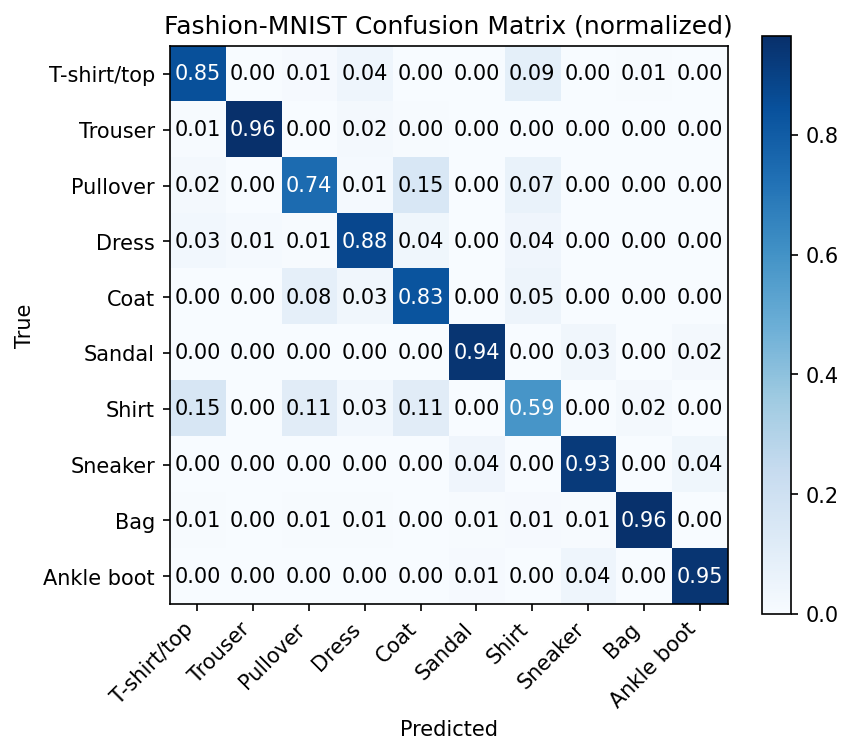

# PyTorch Fashion-MNIST Classifier

A clean, beginner-friendly **PyTorch** project that trains and evaluates classifiers on the [Fashion-MNIST](https://github.com/zalandoresearch/fashion-mnist) dataset. The repo shows good practices: modular `src/` code, CLI args, GPU/CPU support, checkpoints, and a proper evaluation script with a confusion matrix.

---

## ✨Features

- Modular code (`src/`): `data.py`, `models.py`, `train.py`, `eval.py`
- Configurable from the command line (`--epochs`, `--batch_size`, `--lr`, `--cpu`)
- GPU (CUDA) **or** CPU — auto-selects device
- Automatic **best checkpoint** saving to `runs/best.pt`
- Evaluation script:
  - Overall accuracy + per-class precision/recall/F1
  - Normalized confusion matrix saved to `runs/confmat_mlp.png`

---

## Project structure

```
pytorch-fashionmnist/
├─ src/
│  ├─ data.py         # Data & DataLoaders (Fashion-MNIST)
│  ├─ models.py       # MLP (and room for CNNs)
│  ├─ train.py        # Training loop + checkpointing
│  └─ eval.py         # Evaluation, report, confusion matrix
├─ runs/              # Checkpoints & plots (gitignored)
├─ data/              # Dataset cache (gitignored)
├─ .gitignore
├─ README.md
└─ requirements.txt   # (optional, see below)
```

---

## Setup

### 1) Create & activate a virtual environment
**Windows (Git Bash):**
```bash
python -m venv .venv
source .venv/Scripts/activate
```

**macOS/Linux:**
```bash
python -m venv .venv
source .venv/bin/activate
```

### 2) Install dependencies
If you have a CUDA-capable NVIDIA GPU (recommended):
```bash
pip install --upgrade pip
pip install torch torchvision torchaudio --index-url https://download.pytorch.org/whl/cu121
pip install numpy matplotlib scikit-learn tqdm
```

CPU-only (works everywhere):
```bash
pip install --upgrade pip
pip install torch torchvision torchaudio
pip install numpy matplotlib scikit-learn tqdm
```

Verify PyTorch + CUDA:
```bash
python -c "import torch; print('CUDA:', torch.cuda.is_available()); print('Device:', torch.cuda.get_device_name(0) if torch.cuda.is_available() else 'CPU')"
```

> On Windows, keep `num_workers=0` for DataLoader to avoid spawn issues.

---

## 🚀 Usage

### Train (MLP baseline)
```bash
python src/train.py --epochs 5 --batch_size 128 --lr 0.001
```
- Checkpoints are saved to `runs/best.pt` (only when test accuracy improves).
- You can change batch size and learning rate:
  ```bash
  python src/train.py --epochs 8 --batch_size 256 --lr 0.001
  ```

### Evaluate
```bash
python src/eval.py
```
Outputs:
- Overall accuracy + classification report in the terminal
- Confusion matrix image at: `runs/confmat_mlp.png`

---

## 📊 Example results (MLP)

On GPU with 5 epochs:

| Batch size | LR     | Test acc (best) |
|------------|--------|------------------|
| 128        | 0.001  | ~87.4%           |
| 512        | 0.001  | ~87.5%           |
| 4096       | 0.001  | ~84.1%           |
| 4096       | 0.008  | ~86.1%           |

> Tip: very large batches may need a higher LR; small–medium batches (128–512) work well with `lr=1e-3` (Adam).

Confusion matrix (example MLP run):



---

## Command-line arguments

`train.py`:
- `--epochs` (int, default `5`)
- `--batch_size` (int, default `128`)
- `--lr` (float, default `0.001`)
- `--num_workers` (int, default `0`) — keep `0` on Windows
- `--cpu` (flag) — force CPU even if CUDA is available

`eval.py`:
- No flags. Loads `runs/best.pt` and runs on the test set.

---

## Troubleshooting

- **`ModuleNotFoundError: torchvision`**  
  Install it inside the active venv: `pip install torchvision`.
- **`CUDA available: False`** but you have an NVIDIA GPU  
  Install the CUDA build of PyTorch (e.g. `--index-url https://download.pytorch.org/whl/cu121`) and update GPU drivers.
- **DataLoader worker error on Windows**  
  Use `--num_workers 0`.
- **Slow GPU on this project**  
  Fashion-MNIST + MLP is tiny. Try larger batch sizes or a CNN for a clearer GPU speedup.

---

## Next steps (roadmap)

- Add a small **CNN** model and a `--model {mlp,cnn}` switch  
- Try **data augmentation** and **LR schedulers**  
- Log metrics to **TensorBoard** or save training curves  
- Export **ONNX** and try a tiny inference demo app

---

## 📄 License

MIT License © 2025 Arian Vaezi
